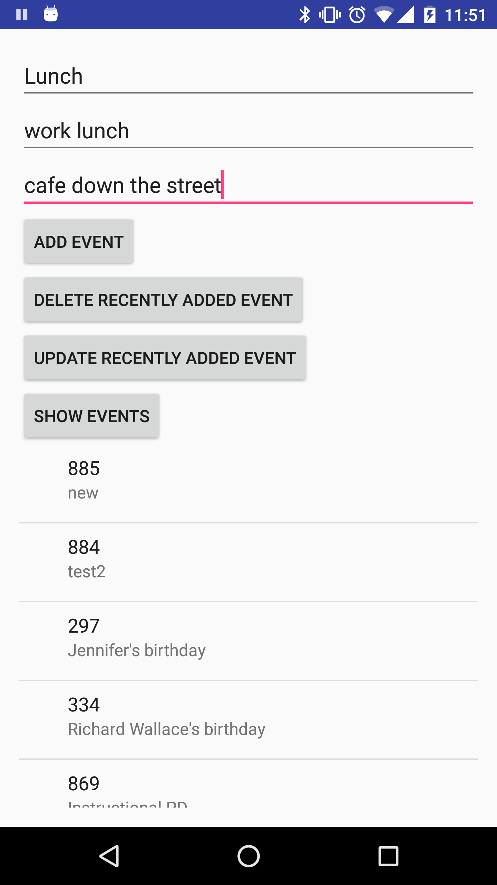

title | type | duration | creator
----- | ---- | -------- | -------
Content Providers | lab | 1:25 | Yuliya Kaleda (New York)

--

#  Content Providers

In this lab, you will be creating an app that will show the events in your phone calendar and will be interacting with the calendar
content provider. There may be many calendars in your phone - to view all of them, use a method `fetchCalendars()` from the starter code that will return all the existing calendar apps in your phone.

To get started, import the [starter-code](stater-code/CalendarCP), add your email address to `MainActivity.java` where indicated.

Next, review the [Android Developer Docs on Calendar Provider](http://developer.android.com/guide/topics/providers/calendar-provider.html) to figure out how to use the Calendar Provider.

You have 4 buttons in the app: add an event to the calendar, show all the existing events, update an event that was recently added and delete an event that was recently added.

Your job is to make these buttons work!

**Work in groups of 2 or 3:** One student should take two of the four methods (see below in requirements), and the second student should take the other two. Make branches off of one of your forked repos.

## Exercise

#### Requirements

In the [starter-code](stater-code/CalendarCP), the main activity contains:

* **list view** - displays all the calendar events (their id and title) returned from the cursor object when "Show Events" button is clicked
* **add event button** - the button gets info from edit texts and should save the event to the calendar provider
* **delete event button** - the button should delete the most recently created event
* **update event button** - the button should update the title of the most recently created event
* **show events button** - the button should display all the calendar events in the list view
* **title edit text** - takes in the title of the event
* **description edit text** - takes in the description of the event
* **location edit text** - takes in the location of the event

You should finish the following methods to make inputs and buttons functional:

* insertEventInCalendar(String title, String description, String location)
* fetchEvents()
* update()
* delete()

In each method, you will find the `//TODO:` hints that will help you write the code needed.

#### Starter code

Grab the [starter-code](stater-code/CalendarCP) and import it into Android Studio.

Included in this lab are the following:

* One activity: **Main Activity**
* One layout file: **activity_main.xml**

#### Deliverable

An Android app that follows the requirements above. There are no design requirements. If you would like to work on the UI, please feel free to modify it but **the main functionality of the app must work.**

When testing the app, make sure your phone is connected to your email account and has some calendar events. Otherwise, your ListView may be empty.  

  

## Additional Resources  
- [Android Developer Docs on Calendar Provider](http://developer.android.com/guide/topics/providers/calendar-provider.html)
